# 👾 Ahmed Sobhi Ali | Cybersecurity Specialist

## 🕵️‍♂️ Ethical Hacker | Penetration Tester | Security Analyst | Purple Team Specialist

🔹 A cybersecurity professional specializing in both **offensive** and **defensive** security, excelling in penetration testing, threat detection, and security monitoring. As a **Purple Team** specialist, I bridge the gap between Red Team (offensive) and Blue Team (defensive) operations, ensuring a well-rounded approach to security.
🔹 Skilled in **cryptography, network security, and secure development**, I focus on proactive defense strategies and real-world attack simulations.
🔹 My expertise extends to **incident response, digital forensics, and OS-level security**, allowing me to detect and mitigate threats before they escalate.
🔹 Passionate about **developing security solutions, reverse engineering, and threat intelligence**, constantly staying ahead of evolving cyber threats.

---

## ⚔️ Area of Expertise

- 🟣 **Purple Teaming (Red & Blue Team Operations)** – Implementing offensive and defensive security measures, running adversary simulations, and enhancing organizational security resilience.
- 🔥 **Security Monitoring & Analysis** – Detecting anomalies and investigating suspicious activities using SIEM solutions and network monitoring tools.
- 🎯 **Vulnerability Assessment** – Identifying security flaws in applications, networks, and systems, prioritizing risks for remediation.
- 🚨 **Incident Response & Digital Forensics** – Investigating security incidents, containing threats, and analyzing attack footprints to improve defense strategies.
- 🏗️ **System Administration & OS Security** – Hardening Linux-based environments, managing configurations, and securing OS kernels.
- 🔐 **Cryptography & Secure Communications** – Implementing encryption standards, PKI management, and cryptanalysis.
- 🛡️ **Threat Detection & Intelligence** – Leveraging OSINT and AI-based analytics for proactive threat hunting.

---

## 🛠️ Technical Skills

### 💻 Programming Languages:
- **Python & Bash** – Scripting automation, exploit development, and security tool development.
- **C++** – Reverse engineering, memory manipulation, and low-level security research.
- **JavaScript** – Web security, penetration testing, and payload development.

### 🖥️ Virtualization:
- **VMware Workstation | Oracle VirtualBox | HyperV** – Setting up test environments and isolated security labs for research.

### 🎭 Social Engineering:
- **Phishing Simulations** – Conducting real-world phishing attacks to test security awareness.
- **Behavioral Analysis** – Understanding human risk factors and psychological manipulation techniques.
- **OSINT** – Gathering intelligence through open-source resources for reconnaissance.

### 🏴‍☠️ Penetration Testing:
- **Vulnerability Scanning** – Using tools like Nessus, OpenVAS, and Burp Suite for security assessments.
- **Exploitation & Privilege Escalation** – Identifying attack vectors and executing controlled exploits.
- **Payload Development & Evasion** – Creating custom payloads to bypass security controls.

### 🏗️ System & Network Security:
- **System Hardening** – Enforcing security policies, SELinux configurations, and securing system permissions.
- **Firewall Configuration** – Managing iptables, firewalld, and network ACLs for traffic control.
- **IDS/IPS Implementation** – Deploying Snort, Suricata, and Zeek for intrusion detection.

### 🔑 Cryptography:
- **SSL/TLS & OpenSSL** – Configuring secure communications.
- **Public Key Infrastructure (PKI)** – Managing encryption keys and certificates.
- **Cryptanalysis** – Evaluating cryptographic implementations for weaknesses.

### 🔍 Secure SDLC:
- **Static & Dynamic Code Analysis** – Utilizing SAST/DAST tools to detect security vulnerabilities in development.
- **Secure Development Practices** – Implementing OWASP and secure coding guidelines.

### 📡 Security Monitoring & Analysis:
- **SIEM & Log Analysis** – Working with Splunk, ELK Stack, and Graylog for log analysis and incident detection.
- **Network Traffic Monitoring** – Analyzing packet captures using Wireshark and Zeek.

---

## 📊 Security Workflow & Approach

## Cybersecurity & AI Intersection

```mermaid
graph LR
  A[Cybersecurity]:::main -->|Penetration Testing| B[Intersection]:::highlight
  A -->|Encryption| B
  A -->|Threat Detection| B
  C[Artificial Intelligence]:::main -->|Machine Learning| B
  C -->|Anomaly Detection| B
  C -->|Automated Response| B
  B -->|AI-powered Security Tools| D[Impact]:::impact
  B -->|Predictive Analytics| D
  classDef main fill:#0a0a0a,stroke:#ffffff,stroke-width:2px;
  classDef highlight fill:#8b0000,stroke:#ffffff,stroke-width:2px;
  classDef impact fill:#006400,stroke:#ffffff,stroke-width:2px;
```

## Cybersecurity Domains Mind Map

```mermaid
graph TD
  A[Cybersecurity]:::main --> B[Penetration Testing]:::highlight
  A --> C[Encryption]:::highlight
  A --> D[Network Security]:::highlight
  A --> E[Incident Response]:::highlight
  A --> F[Security Awareness]:::highlight
  B --> B1[Web Pentesting]:::sub
  B --> B2[Network Pentesting]:::sub
  C --> C1[RSA]:::sub
  C --> C2[AES]:::sub
  D --> D1[Firewalls]:::sub
  D --> D2[IDS/IPS]:::sub
  E --> E1[Threat Hunting]:::sub
  E --> E2[Forensics]:::sub
  F --> F1[Phishing Training]:::sub
  F --> F2[Social Engineering]:::sub
  classDef main fill:#0a0a0a,stroke:#ffffff,stroke-width:2px;
  classDef highlight fill:#8b4513,stroke:#ffffff,stroke-width:2px;
  classDef sub fill:#2f4f4f,stroke:#ffffff,stroke-width:1.5px;
```

## Offensive & Defensive Security Strategies

```mermaid
graph TD
  A[Cybersecurity Strategies]:::main --> B[Offensive Security]:::highlight
  A --> C[Defensive Security]:::highlight
  B --> B1[Penetration Testing]:::sub
  B --> B2[Red Teaming]:::sub
  B --> B3[Vulnerability Assessment]:::sub
  B --> B4[Exploit Development]:::sub
  C --> C1[Blue Teaming]:::sub
  C --> C2[Threat Hunting]:::sub
  C --> C3[SIEM & Log Analysis]:::sub
  C --> C4[Incident Response]:::sub
  B1 --> D[Web & Network Security Testing]:::impact
  C1 --> E[Security Operations]:::impact
  D --> F[Proactive Security Measures]:::impact
  E --> F
  classDef main fill:#0a0a0a,stroke:#ffffff,stroke-width:2px;
  classDef highlight fill:#4b0082,stroke:#ffffff,stroke-width:2px;
  classDef sub fill:#556b2f,stroke:#ffffff,stroke-width:1.5px;
  classDef impact fill:#4682b4,stroke:#ffffff,stroke-width:2px;
```

---

## 🧠 Personal Skills

- 🕵️‍♂️ **Analytical & Critical Thinking** – Solving complex security challenges.
- 🤝 **Collaboration & Conflict Resolution** – Effectively working with security teams.
- ⚡ **High Adaptability & Resilience** – Staying ahead in the dynamic cybersecurity landscape.
- 🔍 **Strong Attention to Detail** – Identifying subtle security flaws.
- 🎤 **Public Speaking** – Communicating security threats clearly.
- 🧠 **Emotional Intelligence** – Understanding human factors in security.

---

## 📂 Featured Projects

- **🔒 Advanced End-to-End Encryption System** – Implemented AES encryption for secure communication with a user-friendly GUI and server-side encrypted connections.
- **💻 Remote Access & Keylogger Tool** – Developed a Python script with Netcat Reverse Shell, keylogging, and data exfiltration for remote monitoring.
- **🦠 Ransomware Simulation** – Created a ransomware simulation with file encryption, persistence, anti-debugging techniques, and network propagation.
- **🛡️ Project Shield - Comprehensive Data Protection System** – Designed a data protection system with AES encryption, secure file deletion, integrity monitoring, and future AI-powered security.
---

## 📖 Current Learning & Research

- 🕵️‍♂️ **Advanced Penetration Testing** – Deep-dive into red teaming methodologies.
- 🤖 **AI for Cybersecurity** – Exploring machine learning applications in security.
- 💻 **Web Application Security & Exploitation** – Mastering OWASP Top 10 vulnerabilities.
- 🔥 **Red Team vs. Blue Team Strategies** – Strengthening offensive and defensive techniques.

---

## 🎯 Let’s Connect

- 📧 **Email:** ahmed.sobhialiy@gmail.com
- 🔗 **LinkedIn:** https://linkedin.com/in/ahmed-sobhi-ali

🚀 Open to collaboration and new challenges in cybersecurity!
